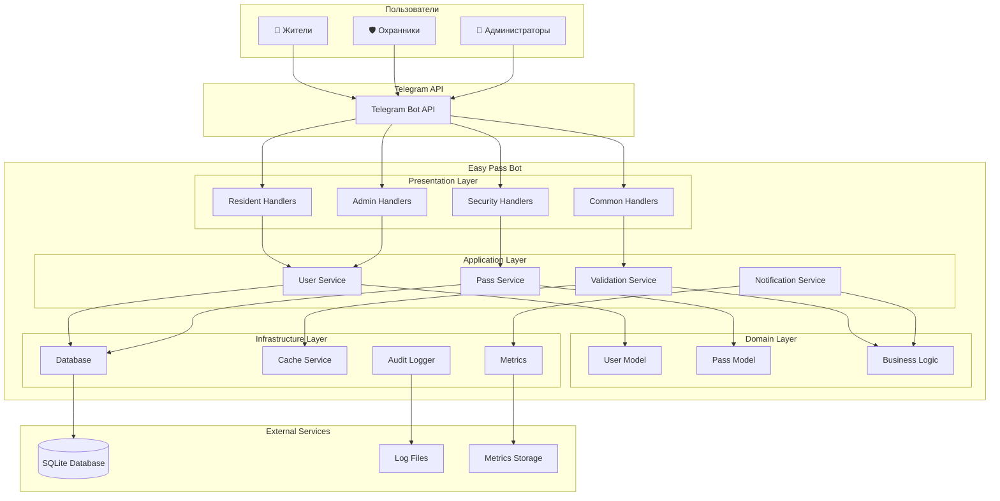
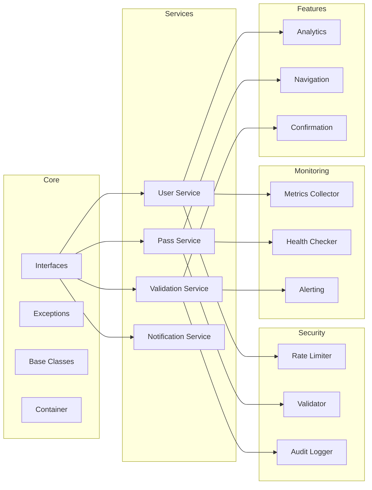
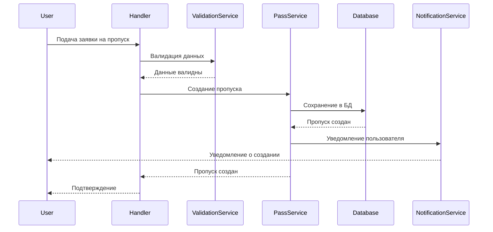
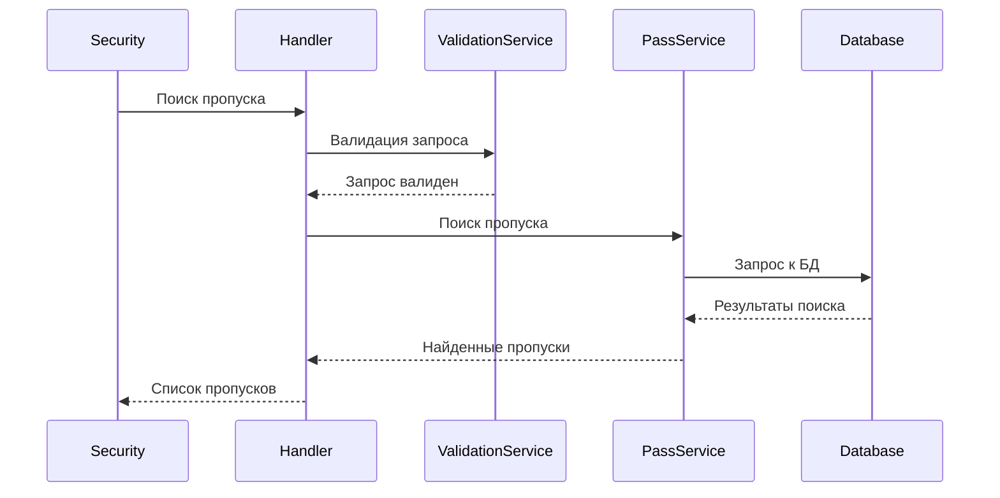
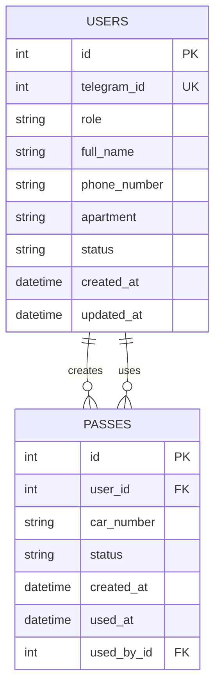
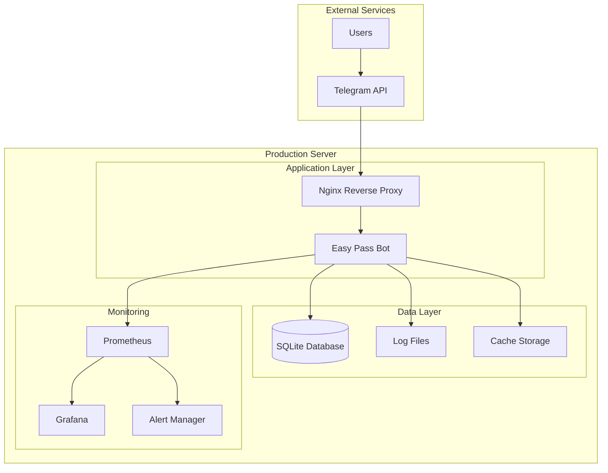

# Архитектура системы

## Обзор

Easy Pass Bot построен на современной архитектуре с использованием принципов Clean Architecture, SOLID и Domain-Driven Design.

## Диаграмма архитектуры



## Слои архитектуры

### 1. Presentation Layer (Слой представления)

**Назначение**: Обработка входящих сообщений от Telegram API

**Компоненты**:
- `ResidentHandlers` - обработчики для жителей
- `SecurityHandlers` - обработчики для охранников
- `AdminHandlers` - обработчики для администраторов
- `CommonHandlers` - общие обработчики

**Принципы**:
- Тонкий слой, только маршрутизация
- Валидация входных данных
- Преобразование в доменные объекты

### 2. Application Layer (Слой приложения)

**Назначение**: Координация бизнес-логики и оркестрация сервисов

**Компоненты**:
- `UserService` - управление пользователями
- `PassService` - управление пропусками
- `ValidationService` - валидация данных
- `NotificationService` - отправка уведомлений

**Принципы**:
- Содержит бизнес-логику приложения
- Координирует доменные сервисы
- Управляет транзакциями

### 3. Domain Layer (Доменный слой)

**Назначение**: Содержит основную бизнес-логику и доменные модели

**Компоненты**:
- `User` - модель пользователя
- `Pass` - модель пропуска
- `Business Logic` - правила бизнеса
- `Domain Events` - доменные события

**Принципы**:
- Независим от внешних зависимостей
- Содержит чистую бизнес-логику
- Определяет интерфейсы для внешних сервисов

### 4. Infrastructure Layer (Слой инфраструктуры)

**Назначение**: Реализация внешних зависимостей и технических деталей

**Компоненты**:
- `Database` - работа с базой данных
- `CacheService` - кэширование
- `Metrics` - сбор метрик
- `AuditLogger` - аудит действий

**Принципы**:
- Реализует интерфейсы доменного слоя
- Содержит технические детали
- Изолирован от бизнес-логики

## Диаграмма компонентов



## Диаграмма последовательности

### Создание пропуска



### Поиск пропуска



## Диаграмма базы данных



## Диаграмма развертывания



## Принципы проектирования

### 1. SOLID принципы

**Single Responsibility Principle (SRP)**
- Каждый класс имеет одну ответственность
- `UserService` - только управление пользователями
- `PassService` - только управление пропусками

**Open/Closed Principle (OCP)**
- Код открыт для расширения, закрыт для модификации
- Новые типы валидации через наследование
- Новые типы уведомлений через интерфейсы

**Liskov Substitution Principle (LSP)**
- Подклассы могут заменять базовые классы
- Все сервисы реализуют свои интерфейсы
- Все валидаторы наследуют от `BaseValidator`

**Interface Segregation Principle (ISP)**
- Интерфейсы разделены по функциональности
- `IUserService` - только для пользователей
- `IPassService` - только для пропусков

**Dependency Inversion Principle (DIP)**
- Зависимость от абстракций, не от конкретных классов
- Использование интерфейсов
- Dependency Injection контейнер

### 2. Clean Architecture

**Независимость от фреймворков**
- Бизнес-логика не зависит от aiogram
- Можно заменить Telegram на другой мессенджер

**Тестируемость**
- Каждый компонент можно тестировать изолированно
- Использование моков и стабов

**Независимость от UI**
- Логика не привязана к Telegram интерфейсу
- Можно добавить веб-интерфейс

**Независимость от базы данных**
- Бизнес-логика не зависит от SQLite
- Можно заменить на PostgreSQL

### 3. Domain-Driven Design

**Ubiquitous Language**
- Общие термины для всех участников
- `User`, `Pass`, `Resident`, `Security`, `Admin`

**Bounded Contexts**
- Четкие границы между доменами
- Отдельные модели для разных контекстов

**Aggregates**
- `User` - агрегат пользователя
- `Pass` - агрегат пропуска

## Паттерны проектирования

### 1. Repository Pattern

```python
class IUserRepository(ABC):
    @abstractmethod
    async def get_by_id(self, user_id: int) -> Optional[User]:
        pass
    
    @abstractmethod
    async def create(self, user: User) -> int:
        pass
```

### 2. Service Layer Pattern

```python
class UserService:
    def __init__(self, user_repo: IUserRepository):
        self.user_repo = user_repo
    
    async def create_user(self, **kwargs) -> User:
        # Бизнес-логика
        pass
```

### 3. Dependency Injection

```python
@inject('user_service')
class UserHandler:
    def __init__(self, user_service: IUserService):
        self.user_service = user_service
```

### 4. Observer Pattern

```python
class EventBus:
    def __init__(self):
        self.observers = []
    
    def subscribe(self, observer):
        self.observers.append(observer)
    
    def notify(self, event):
        for observer in self.observers:
            observer.handle(event)
```

### 5. Factory Pattern

```python
class ServiceFactory:
    @staticmethod
    def create_user_service() -> IUserService:
        user_repo = UserRepository()
        notification_service = NotificationService()
        return UserService(user_repo, notification_service)
```

## Масштабирование

### Горизонтальное масштабирование

1. **Load Balancer** - распределение нагрузки
2. **Multiple Instances** - несколько экземпляров бота
3. **Shared Database** - общая база данных
4. **Message Queue** - очередь сообщений

### Вертикальное масштабирование

1. **More CPU** - больше процессорных ядер
2. **More RAM** - больше оперативной памяти
3. **SSD Storage** - быстрый диск
4. **Network Optimization** - оптимизация сети

## Мониторинг и наблюдаемость

### Метрики

- **Business Metrics** - бизнес-метрики
- **Technical Metrics** - технические метрики
- **Performance Metrics** - метрики производительности

### Логирование

- **Structured Logging** - структурированные логи
- **Log Levels** - уровни логирования
- **Log Aggregation** - агрегация логов

### Трассировка

- **Distributed Tracing** - распределенная трассировка
- **Request Tracing** - трассировка запросов
- **Performance Tracing** - трассировка производительности

## Безопасность

### Аутентификация и авторизация

- **JWT Tokens** - токены для API
- **Role-Based Access** - доступ на основе ролей
- **Permission Matrix** - матрица разрешений

### Защита данных

- **Encryption at Rest** - шифрование в покое
- **Encryption in Transit** - шифрование в передаче
- **Data Masking** - маскирование данных

### Аудит

- **Audit Logging** - логирование аудита
- **Compliance** - соответствие требованиям
- **Data Retention** - хранение данных

## Заключение

Архитектура Easy Pass Bot спроектирована с учетом современных принципов разработки, обеспечивая:

- **Масштабируемость** - легко добавлять новые функции
- **Тестируемость** - каждый компонент тестируется изолированно
- **Поддерживаемость** - код легко понимать и изменять
- **Производительность** - оптимизированная работа
- **Безопасность** - защита данных и пользователей

Эта архитектура позволяет системе расти и развиваться вместе с потребностями пользователей.


